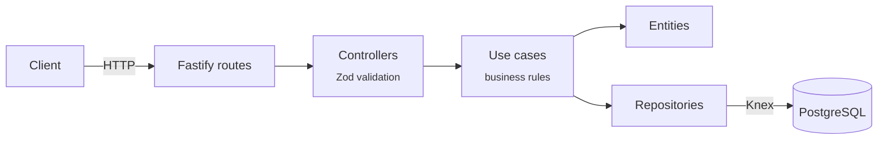
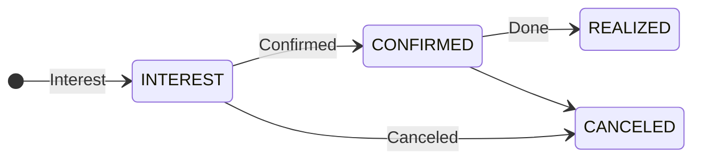
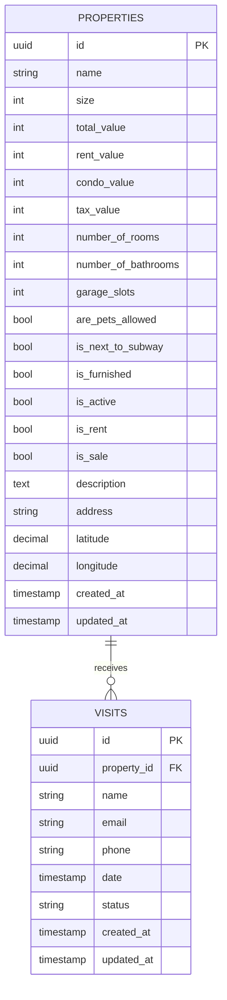

<div align="center">

# 🏡 Elite Home: API

**A property management and visit scheduling API: complete listings for sale and rent, with visit status tracking.**


[About](#-about) •
[Architecture](#-architecture) •
[Getting started](#-getting-started) •
[Endpoints](#-endpoints) •
[Data model](#-data-model) •
[Tech stack](#-tech-stack)

</div>

---

## 📖 About

**Elite Home API** is the backend of a real estate platform. It lets a manager:

- 🏠 **register properties** with every detail: size, prices (sale, rent, condo fee, property tax), rooms, parking spaces, geographic location and features;
- ✏️ **update** any property information;
- 🔎 **list and look up** properties;
- 📆 **record visits** from interested people and track each visit’s status.

The project follows a layered architecture inspired by **Clean Architecture**, separating HTTP routes, use cases, entities and repositories.

## ✨ Features

| | Feature | Description |
|---|---|---|
| 🏠 | **Property listings** | 18+ attributes: prices, rooms, pets, subway, furniture... |
| 🏷️ | **Sale and/or rent** | The same property can be available for both |
| 📍 | **Geolocation** | Address + latitude/longitude |
| 📆 | **Visit scheduling** | Name, e-mail, phone, date and status |
| 🔁 | **Visit status** | `INTEREST` → `CONFIRMED` → `REALIZED` or `CANCELED` |
| 🛡️ | **Validation** | Payloads validated with Zod and standardized errors |
| 🗃️ | **Migrations** | Database versioning with Knex |

## 🧱 Architecture



```
src/
├── config/          # Environment variable loading and validation
├── database/
│   ├── migrations/  # Knex migrations
│   ├── repositories/# Data access (properties, visits)
│   └── schemas/     # Entity ⇄ table mapping
├── entities/        # Property, Visit
├── enums/           # VisitStatus
├── errors/          # AppError, NotFoundError
├── http/
│   ├── controllers/ # base (info) and properties
│   ├── app.ts       # Fastify instance + error handler
│   └── server.ts    # Bootstrap
└── use-cases/       # create/update/find/search property, create visit, app info
```

## 🚀 Getting started

### Prerequisites

- [Node.js](https://nodejs.org/) 18+
- [PostgreSQL](https://www.postgresql.org/) (local or via Docker)

### Step by step

```bash
# 1. Clone the repository
git clone https://github.com/agustinhopneto/dc-elitehome-api.git
cd dc-elitehome-api

# 2. Install the dependencies
npm install

# 3. Set up the environment variables
cp .env.example .env
# edit .env with your PostgreSQL connection details

# 4. Run the migrations
npx knex migrate:latest

# 5. Start the server in development mode
npm run dev
```

> 💡 **Tip:** spin up PostgreSQL quickly with Docker:
> ```bash
> docker run -d --name elitehome-db -e POSTGRES_PASSWORD=docker -p 5432:5432 postgres
> ```

## 📡 Endpoints

| Method | Route | Description |
|---|---|---|
| `GET` | `/` | Application info |
| `GET` | `/manager/properties` | Lists all properties |
| `GET` | `/manager/properties/:id` | Property details |
| `POST` | `/manager/properties` | Creates a property |
| `PATCH` | `/manager/properties/:id` | Partially updates a property |
| `POST` | `/manager/properties/:id/visit` | Records a visit to the property |

<details>
<summary><b>🏠 POST /manager/properties: body example</b></summary>

```json
{
  "name": "2-bedroom apartment in Vila Mariana",
  "size": 68,
  "totalValue": 750000,
  "rentValue": 3800,
  "condoValue": 850,
  "taxValue": 220,
  "numberOfRooms": 2,
  "numberOfBathrooms": 2,
  "garageSlots": 1,
  "arePetsAllowed": true,
  "isNextToSubway": true,
  "isFurnished": false,
  "isActive": true,
  "isRent": true,
  "isSale": true,
  "description": "Renovated apartment on a high floor with a gourmet balcony.",
  "address": "Rua Domingos de Morais, 1000 - São Paulo/SP",
  "latitude": -23.5891,
  "longitude": -46.6347
}
```

| Field | Type | Rule |
|---|---|---|
| `name` | string | 1 to 255 characters |
| `size` | number | Size in m² |
| `totalValue`, `rentValue`, `condoValue`, `taxValue` | integer | Monetary values |
| `numberOfRooms`, `numberOfBathrooms`, `garageSlots` | integer | |
| `arePetsAllowed`, `isNextToSubway`, `isFurnished`, `isActive`, `isRent`, `isSale` | boolean | |
| `description` | string | Up to 1000 characters |
| `address` | string | |
| `latitude`, `longitude` | number | |

In the `PATCH` route every field is **optional**.

</details>

<details>
<summary><b>📆 POST /manager/properties/:id/visit: body example</b></summary>

```json
{
  "name": "Maria Souza",
  "email": "maria@email.com",
  "phone": "(11)91234-5678",
  "date": "2024-10-05T14:00:00.000Z",
  "status": "INTEREST"
}
```

| Field | Type | Rule |
|---|---|---|
| `name` | string | 1 to 255 characters |
| `email` | string | Valid e-mail |
| `phone` | string | Exactly 14 characters |
| `date` | date | Visit date/time |
| `status` | enum | `INTEREST`, `CONFIRMED`, `REALIZED` or `CANCELED` |

</details>

### Visit status



### Error responses

| Code | When | Body |
|---|---|---|
| `400` | Validation failure (Zod) | `{ "message": "Validation error.", "issues": { ... } }` |
| `404` | Property not found | `{ "message": "..." }` |
| `500` | Unexpected error | `{ "message": "Internal server error." }` |

## 🗃️ Data model



## 🛠️ Tech stack

- **[Fastify](https://fastify.dev/)**: fast and lightweight HTTP framework
- **[Knex.js](https://knexjs.org/)** + **[pg](https://node-postgres.com/)**: query builder and migrations for PostgreSQL
- **[Zod](https://zod.dev/)**: payload validation
- **[env-var](https://github.com/evanshortiss/env-var)** + **[dotenv](https://github.com/motdotla/dotenv)**: typed environment variables
- **[tsx](https://github.com/privatenumber/tsx)**: runs TypeScript with hot reload
- **[Biome](https://biomejs.dev/)**: linting and formatting

---

<div align="center">

Made with 💙 by **[Agustinho Neto](https://github.com/agustinhopneto)**

</div>
