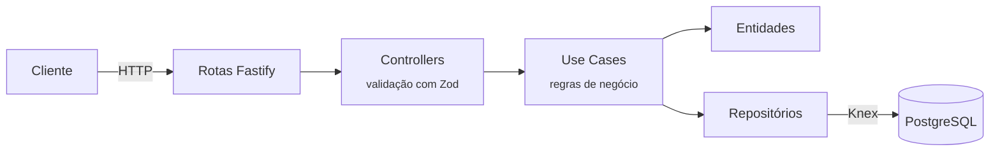
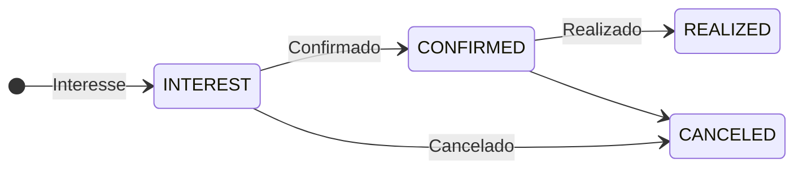
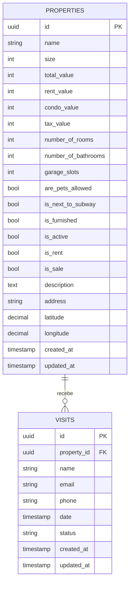

<div align="center">

# 🏡 Elite Home — API

**API para gestão de imóveis e agendamento de visitas: cadastro completo de imóveis para venda e aluguel, com controle de status das visitas.**


[Sobre](#-sobre) •
[Arquitetura](#-arquitetura) •
[Como rodar](#-como-rodar) •
[Endpoints](#-endpoints) •
[Modelo de dados](#-modelo-de-dados) •
[Tecnologias](#-tecnologias)

</div>

---

## 📖 Sobre

A **Elite Home API** é o backend de uma plataforma imobiliária. Ela permite ao gestor:

- 🏠 **cadastrar imóveis** com todos os detalhes: metragem, valores (venda, aluguel, condomínio, IPTU), cômodos, vagas, localização geográfica e características;
- ✏️ **atualizar** qualquer informação de um imóvel;
- 🔎 **listar e consultar** imóveis;
- 📆 **registrar visitas** de interessados, acompanhando o status de cada uma.

O projeto segue uma arquitetura em camadas inspirada em **Clean Architecture**, separando rotas HTTP, casos de uso, entidades e repositórios.

## ✨ Funcionalidades

| | Recurso | Descrição |
|---|---|---|
| 🏠 | **Cadastro de imóveis** | Mais de 18 atributos: valores, cômodos, pets, metrô, mobília... |
| 🏷️ | **Venda e/ou aluguel** | Um mesmo imóvel pode estar disponível para os dois |
| 📍 | **Geolocalização** | Endereço + latitude/longitude |
| 📆 | **Agendamento de visitas** | Nome, e-mail, telefone, data e status |
| 🔁 | **Status de visita** | `INTEREST` → `CONFIRMED` → `REALIZED` ou `CANCELED` |
| 🛡️ | **Validação** | Payloads validados com Zod e erros padronizados |
| 🗃️ | **Migrations** | Versionamento do banco com Knex |

## 🧱 Arquitetura



```
src/
├── config/          # Leitura e validação das variáveis de ambiente
├── database/
│   ├── migrations/  # Migrations do Knex
│   ├── repositories/# Acesso a dados (properties, visits)
│   └── schemas/     # Mapeamento entidade ⇄ tabela
├── entities/        # Property, Visit
├── enums/           # VisitStatus
├── errors/          # AppError, NotFoundError
├── http/
│   ├── controllers/ # base (info) e properties
│   ├── app.ts       # Instância do Fastify + error handler
│   └── server.ts    # Bootstrap
└── use-cases/       # create/update/find/search property, create visit, app info
```

## 🚀 Como rodar

### Pré-requisitos

- [Node.js](https://nodejs.org/) 18+
- [PostgreSQL](https://www.postgresql.org/) (local ou via Docker)

### Passo a passo

```bash
# 1. Clone o repositório
git clone https://github.com/agustinhopneto/dc-elitehome-api.git
cd dc-elitehome-api

# 2. Instale as dependências
npm install

# 3. Configure as variáveis de ambiente
cp .env.example .env
# edite o .env com os dados de conexão do seu PostgreSQL

# 4. Rode as migrations
npx knex migrate:latest

# 5. Suba o servidor em modo desenvolvimento
npm run dev
```

> 💡 **Dica:** para subir um PostgreSQL rapidamente com Docker:
> ```bash
> docker run -d --name elitehome-db -e POSTGRES_PASSWORD=docker -p 5432:5432 postgres
> ```

## 📡 Endpoints

| Método | Rota | Descrição |
|---|---|---|
| `GET` | `/` | Informações da aplicação |
| `GET` | `/manager/properties` | Lista todos os imóveis |
| `GET` | `/manager/properties/:id` | Detalhes de um imóvel |
| `POST` | `/manager/properties` | Cadastra um imóvel |
| `PATCH` | `/manager/properties/:id` | Atualiza parcialmente um imóvel |
| `POST` | `/manager/properties/:id/visit` | Registra uma visita para o imóvel |

<details>
<summary><b>🏠 POST /manager/properties: exemplo de body</b></summary>

```json
{
  "name": "Apartamento 2 quartos na Vila Mariana",
  "size": 68,
  "totalValue": 750000,
  "rentValue": 3800,
  "condoValue": 850,
  "taxValue": 220,
  "numberOfRooms": 2,
  "numberOfBathrooms": 2,
  "garageSlots": 1,
  "arePetsAllowed": true,
  "isNextToSubway": true,
  "isFurnished": false,
  "isActive": true,
  "isRent": true,
  "isSale": true,
  "description": "Apartamento reformado, andar alto, varanda gourmet.",
  "address": "Rua Domingos de Morais, 1000 - São Paulo/SP",
  "latitude": -23.5891,
  "longitude": -46.6347
}
```

| Campo | Tipo | Regra |
|---|---|---|
| `name` | string | 1 a 255 caracteres |
| `size` | number | Metragem |
| `totalValue`, `rentValue`, `condoValue`, `taxValue` | integer | Valores monetários |
| `numberOfRooms`, `numberOfBathrooms`, `garageSlots` | integer | |
| `arePetsAllowed`, `isNextToSubway`, `isFurnished`, `isActive`, `isRent`, `isSale` | boolean | |
| `description` | string | Até 1000 caracteres |
| `address` | string | |
| `latitude`, `longitude` | number | |

No `PATCH`, todos os campos são **opcionais**.

</details>

<details>
<summary><b>📆 POST /manager/properties/:id/visit: exemplo de body</b></summary>

```json
{
  "name": "Maria Souza",
  "email": "maria@email.com",
  "phone": "(11)91234-5678",
  "date": "2024-10-05T14:00:00.000Z",
  "status": "INTEREST"
}
```

| Campo | Tipo | Regra |
|---|---|---|
| `name` | string | 1 a 255 caracteres |
| `email` | string | E-mail válido |
| `phone` | string | Exatamente 14 caracteres |
| `date` | date | Data/hora da visita |
| `status` | enum | `INTEREST`, `CONFIRMED`, `REALIZED` ou `CANCELED` |

</details>

### Status de visita



### Respostas de erro

| Código | Quando | Corpo |
|---|---|---|
| `400` | Falha de validação (Zod) | `{ "message": "Validation error.", "issues": { ... } }` |
| `404` | Imóvel não encontrado | `{ "message": "..." }` |
| `500` | Erro inesperado | `{ "message": "Internal server error." }` |

## 🗃️ Modelo de dados



## 🛠️ Tecnologias

- **[Fastify](https://fastify.dev/)**: framework HTTP rápido e leve
- **[Knex.js](https://knexjs.org/)** + **[pg](https://node-postgres.com/)**: query builder e migrations para PostgreSQL
- **[Zod](https://zod.dev/)**: validação de payloads
- **[env-var](https://github.com/evanshortiss/env-var)** + **[dotenv](https://github.com/motdotla/dotenv)**: variáveis de ambiente tipadas
- **[tsx](https://github.com/privatenumber/tsx)**: execução de TypeScript com hot reload
- **[Biome](https://biomejs.dev/)**: lint e formatação

---

<div align="center">

Feito com 💙 por **[Agustinho Neto](https://github.com/agustinhopneto)**

</div>
